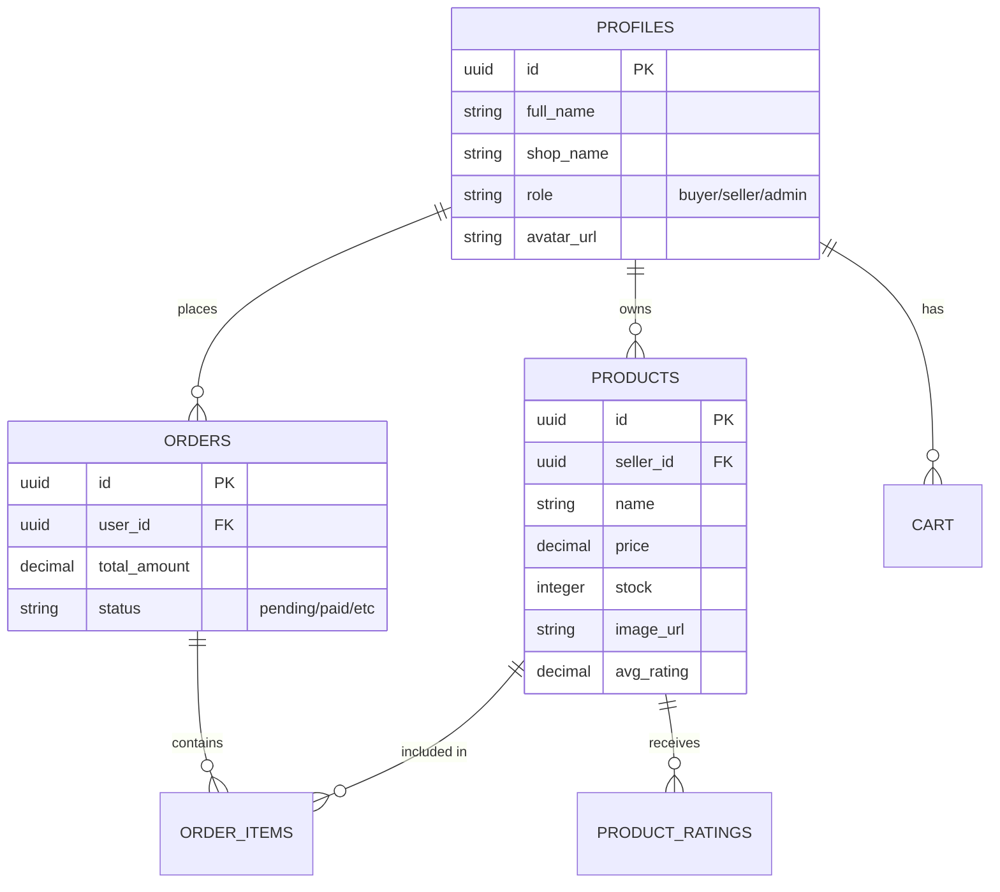

# KaryaNusa - Digital Asset Marketplace


KaryaNusa adalah platform marketplace modern yang dirancang khusus untuk memperjualbelikan aset digital (audio, PDF, ZIP, dll) dengan dukungan teknologi Web3 dan sistem keamanan berbasis Supabase.

## 🏛️ Arsitektur Sistem

KaryaNusa menggunakan arsitektur **Client-Server-Cloud** yang terpisah untuk memastikan skalabilitas dan keamanan data.

```mermaid
graph TD
    User((User/Client)) --> Frontend[React 19 Frontend]
    Frontend --> Express[Node/Express Backend]
    Express --> SupabaseAuth[Supabase Auth]
    Express --> SupabaseDB[(PostgreSQL Database)]
    Express --> SupabaseStorage[Supabase Storage]
    
    subgraph "Logic Layer"
    Express -- Auth Middleware -- JWT[JWT Verification]
    Express -- RBAC -- Profiles[(Profiles Table)]
    end
```

## ✨ Fitur Utama

- **🚀 Hybrid Authentication:** Mendukung login via Google OAuth, Email tradisional, dan integrasi Web3 Wallet (MetaMask).
- **🔒 Secure Asset Delivery:** Aset digital disimpan secara aman di Supabase Storage dengan akses terkontrol.
- **💼 Dual Role System:** Pemisahan fungsionalitas antara **Seller** (Manajemen Produk, Statistik) dan **Buyer** (Eksplorasi, Transaksi).
- **💬 Real-time Communication:** Sistem chat antar pengguna untuk negosiasi dan dukungan.
- **📊 Interactive Dashboard:** Visualisasi statistik penjualan dan ringkasan transaksi bagi penjual.
- **🎨 Modern UI/UX:** Dibangun dengan **Tailwind CSS 4** dan **Framer Motion** untuk pengalaman pengguna yang halus.

## 🛠️ Tech Stack Dalam Angka

| Komponen | Teknologi | Keterangan |
| :--- | :--- | :--- |
| **Frontend** | React 19, Vite, Tailwind 4 | Next-gen JS framework & styling |
| **Backend** | Node.js, Express | Middleware logic & API Routing |
| **Database** | PostgreSQL (Supabase) | Relational storage & RLS Policies |
| **Auth** | Supabase Auth (JWT) | Secure session management |
| **File Storage**| Supabase Storage | Large file asset handling |
| **Blockchain** | Ethers.js | Web3 wallet connectivity |

## 📊 Model Data (Entity Relationship)

Sistem menggunakan database relasional PostgreSQL dengan skema berikut:



## 🔐 Aliran Autentikasi

1. **Client** melakukan login melalui Supabase Auth.
2. **Supabase** mengirimkan **JWT Access Token**.
3. **Client** mengirimkan token tersebut di header setiap request ke **Express Backend**.
4. **Backend** memverifikasi token dan mengambil data profil tambahan dari tabel `profiles` (RBAC).

## 📁 Struktur Proyek

```text
Karyanusa/
├── backend/                # Express.js API
│   ├── src/
│   │   ├── config/         # Konfigurasi Supabase & Env
│   │   ├── controller/     # Logika Bisnis (Auth, Produk, Order)
│   │   ├── middleware/     # Proteksi rute (JWT & RBAC)
│   │   └── routes/         # Definisi Endpoint API
│   └── setup.sql           # Skema Database PostgreSQL
└── frontend/               # Vite/React App
    ├── src/
    │   ├── context/        # Global State (Auth, Theme, Cart)
    │   ├── components/     # UI Reusable Components
    │   └── pages/          # Halaman Utama Aplikasi
```

## 🚀 Instalasi Cepat

### Prasyarat
- Node.js v18+
- Akun Supabase (untuk Database & Auth)

### Setup Backend
```bash
cd backend
npm install
# Buat file .env berdasarkan instruksi di bawah
npm run dev
```

### Setup Frontend
```bash
cd frontend
npm install
# Buat file .env berdasarkan instruksi di bawah
npm run dev
```

## ⚙️ Konfigurasi Environment

Pastikan file `.env` sudah dikonfigurasi dengan benar di masing-masing direktori:

**Backend (`/backend/.env`):**
```env
SUPABASE_URL=...
SUPABASE_ANON_KEY=...
SUPABASE_SERVICE_ROLE_KEY=...
PORT=5001
```

**Frontend (`/frontend/.env`):**
```env
VITE_SUPABASE_URL=...
VITE_SUPABASE_ANON_KEY=...
VITE_API_URL=http://localhost:5001/api
```

---

Dibuat dengan ❤️ untuk kemajuan ekonomi digital Indonesia.
